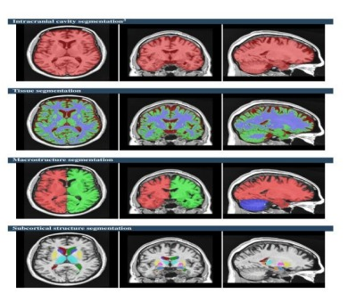
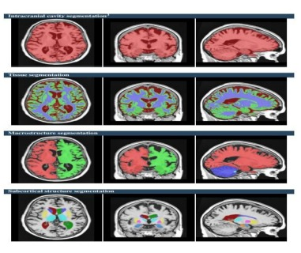
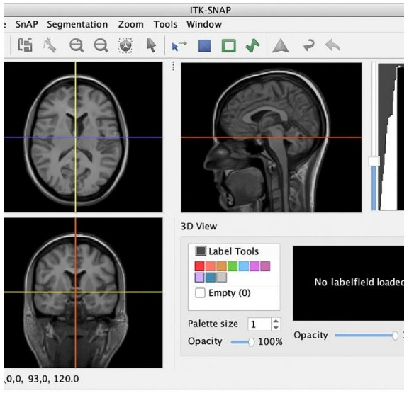
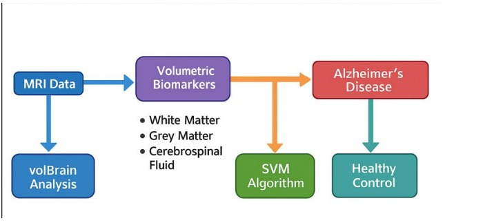

# Alzheimer-Disease-Classification-Using-MRI
# 🧠 Classification of Alzheimer’s Disease and Healthy Control from 3D Brain MRI Images

## 📌 Project Overview
Alzheimer’s Disease (AD) is a progressive neurodegenerative disorder that causes memory loss, cognitive decline, and structural deterioration of the brain. Early and accurate diagnosis is essential for effective treatment and patient care.

This project presents a **machine-learning-based classification system** that distinguishes **Alzheimer’s Disease (AD)** patients from **Healthy Controls (HC)** using **volumetric features extracted from 3D brain MRI scans**. The system uses **White Matter (WM)**, **Grey Matter (GM)**, and **Cerebrospinal Fluid (CSF)** volumes as biomarkers and classifies subjects using a **Support Vector Machine (SVM)**.

MRI data is obtained from the **Alzheimer’s Disease Neuroimaging Initiative (ADNI)** and processed using **ITK-SNAP** and **volBrain** platforms.

---

## 🎯 Objectives
- Automate the classification of Alzheimer’s Disease using MRI data  
- Extract reliable volumetric biomarkers (WM, GM, CSF)  
- Build an interpretable and efficient SVM-based classifier  
- Evaluate performance using standard machine learning metrics  

---

## 🧠 Dataset Description
- **Source**: Alzheimer’s Disease Neuroimaging Initiative (ADNI)  
- **Data Type**: 3D T1-weighted MRI scans  
- **Format**: NIFTI (`.nii`)  
- **Classes**:
  - Alzheimer’s Disease (AD)
  - Healthy Control (HC)

MRI scans are validated using **ITK-SNAP**, and volumetric features are extracted using **volBrain**. Only WM, GM, and CSF percentages are used for classification.

---

## 🔬 Feature Extraction
The following volumetric biomarkers are extracted:
- **White Matter (WM %)**
- **Grey Matter (GM %)**
- **Cerebrospinal Fluid (CSF %)**

These features are well-established indicators of neurodegeneration in Alzheimer’s Disease.

---

## ⚙️ Methodology Pipeline
1. MRI Acquisition from ADNI  
2. Preprocessing using ITK-SNAP  
   - Orientation check  
   - Missing slice detection  
   - Artifact verification  
3. Volumetric feature extraction using volBrain  
4. Dataset creation and labeling  
   - AD = 1  
   - HC = 0  
5. Train–Test split (70% / 30%)  
6. SVM model training  
7. Model evaluation  

---

## 🖼️ Sample MRI Visualizations

### Healthy Control MRI

### Alzheimer’s Disease MRI

### MRI Visualization using ITK-SNAP

### Volumetric Segmentation (WM, GM, CSF)

---

## 🤖 Machine Learning Model
- **Algorithm**: Support Vector Machine (SVM)  
- **Kernel**: Radial Basis Function (RBF)  

### Why SVM?
- Performs well on small to medium datasets  
- Handles non-linear feature relationships  
- Creates strong decision boundaries  
- Effective with limited numerical features  

---

## 🔁 SVM Classification Workflow

---

## 📊 Model Evaluation

### Metrics Used
- Accuracy  
- Precision  
- Recall  
- F1-Score  
- Confusion Matrix  
- ROC-AUC  

### Performance Results
| Metric | Value |
|------|------|
| Accuracy | 75% |
| Precision | 83.33% |
| Recall | 62.50% |
| F1-Score | 71.42% |
| ROC-AUC | 79.68% |

---

## 📊 Confusion Matrix

The results demonstrate that volumetric MRI biomarkers are effective for differentiating Alzheimer’s Disease patients from healthy individuals.

---

## 🧰 Tools & Technologies

### Software
- Python 3.8+
- Scikit-learn
- NumPy
- Pandas
- Matplotlib
- Seaborn
- ITK-SNAP
- volBrain
- Google Colab

### Hardware
- Intel Core i3 / i5 / i7 (or equivalent)
- Minimum 4 GB RAM
- 10 GB Storage

---

## 📁 Recommended Project Structure
Alzheimer-Classification/
│
├── data/ # (not uploaded to GitHub)
│
├── images/
│ ├── hc_mri.png
│ ├── ad_mri.png
│ ├── itk_snap_view.png
│ ├── volbrain_segmentation.png
│ ├── svm_flow.png
│ └── confusion_matrix.png
│
├── notebooks/
│ └── svm_classification.ipynb
│
├── src/
│ └── model.py
│
├── README.md
├── requirements.txt
└── .gitignore

